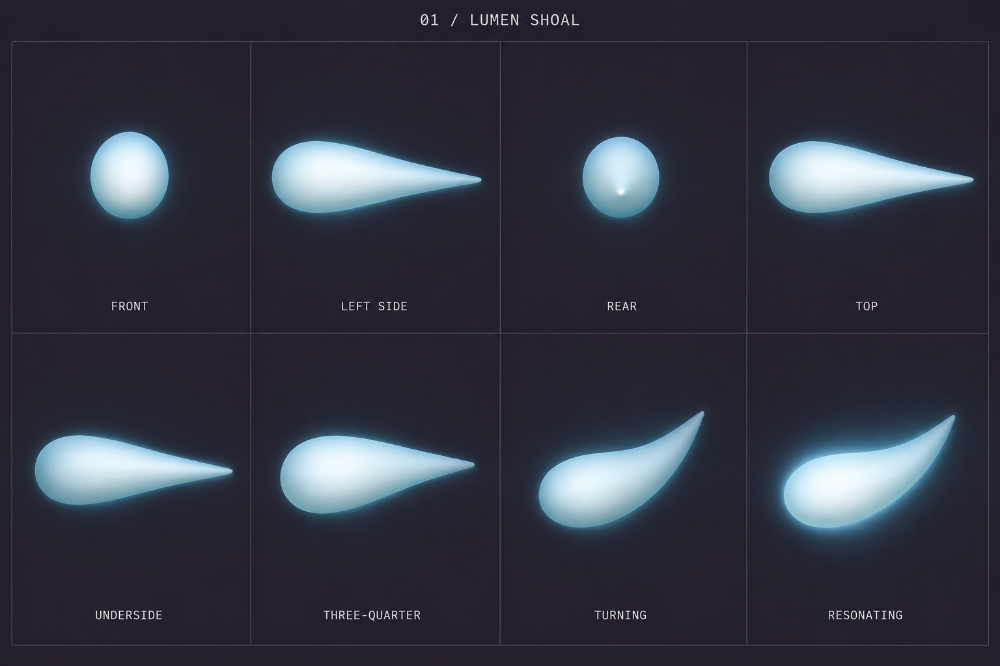
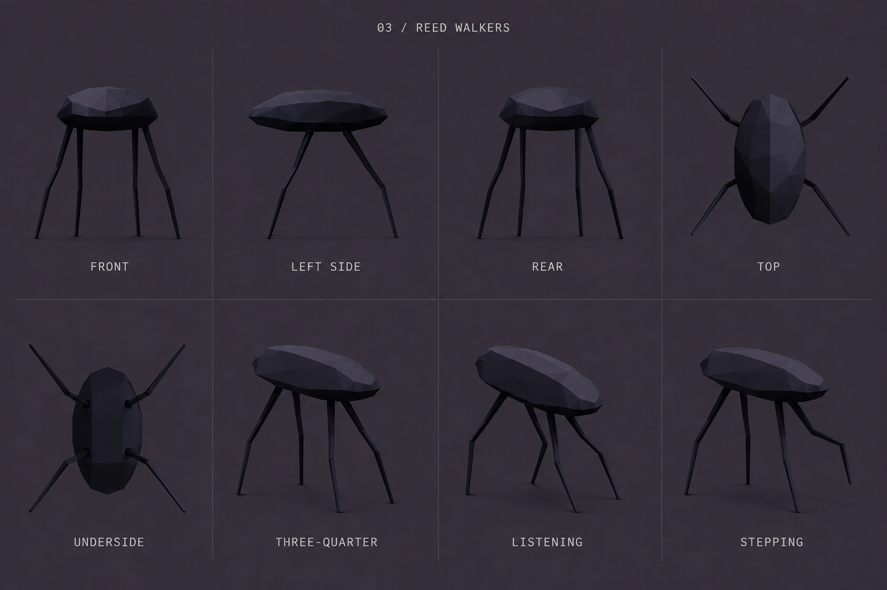
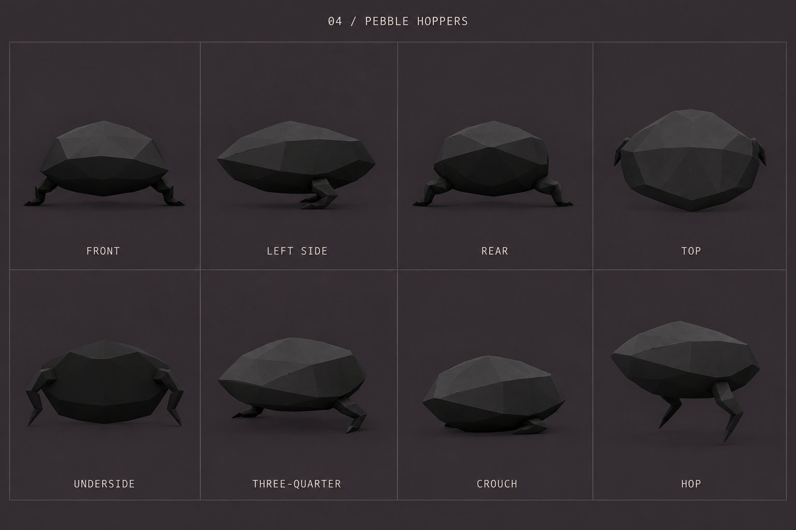
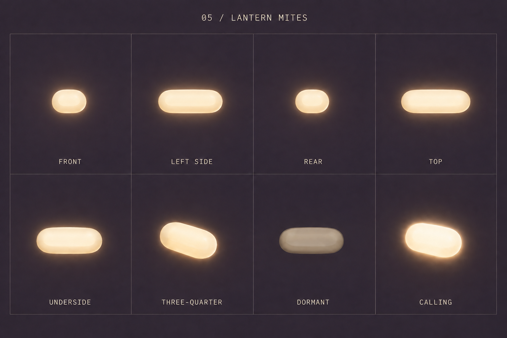

# Nowherelands 2 — Fauna reference sheets v1

Four creature studies generated with the built-in image generation tool on 2026-09-06, based on the approved fauna concept board and game screenshot.

Each sheet includes front, left side, rear, top, underside, three-quarter, and two behavior/material studies. These are concept turnarounds for discussing form before 3D modeling; they are not frame-aligned animation atlases. Exact projection, facet patterns and proportions still need to be reconciled on the eventual model.

These September 6 sheets are historical concept references. Later creature refinements supersede their original form decisions; use the current species documentation and atelier for the implemented designs.

## Original form decisions

- Lumen shoal: one continuous tapered light volume; no fins or separate tail. Turns bend the body; resonance changes emission.
- Reed walkers: pebble body with exactly four long, thin, jointed legs. No separate head.
- Pebble hoppers: low faceted body with exactly two short folded legs; the resting silhouette reads as a stone.
- Lantern mites: one tiny rounded light seed, shown enlarged. No insect anatomy; dormant and calling states share geometry.

Absolute scale is not established by these sheets. Every species fills its own panels independently. For modeling, glow should remain a material/effect around the underlying form; compare the restrained-glow views when judging silhouettes.

## Sheets

### Lumen shoal

### Reed walkers

### Pebble hoppers

### Lantern mites

## Generation record

[Full prompts](./PROMPTS.md). The lantern mite front/side/rear views were corrected in a second image generation pass.
