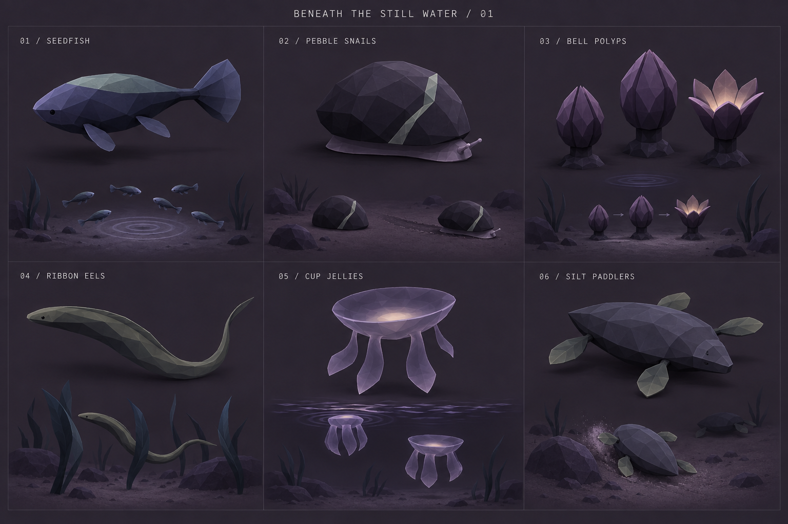
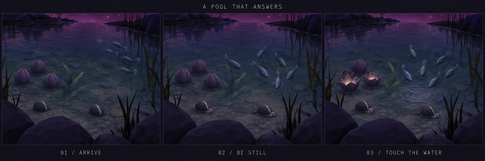
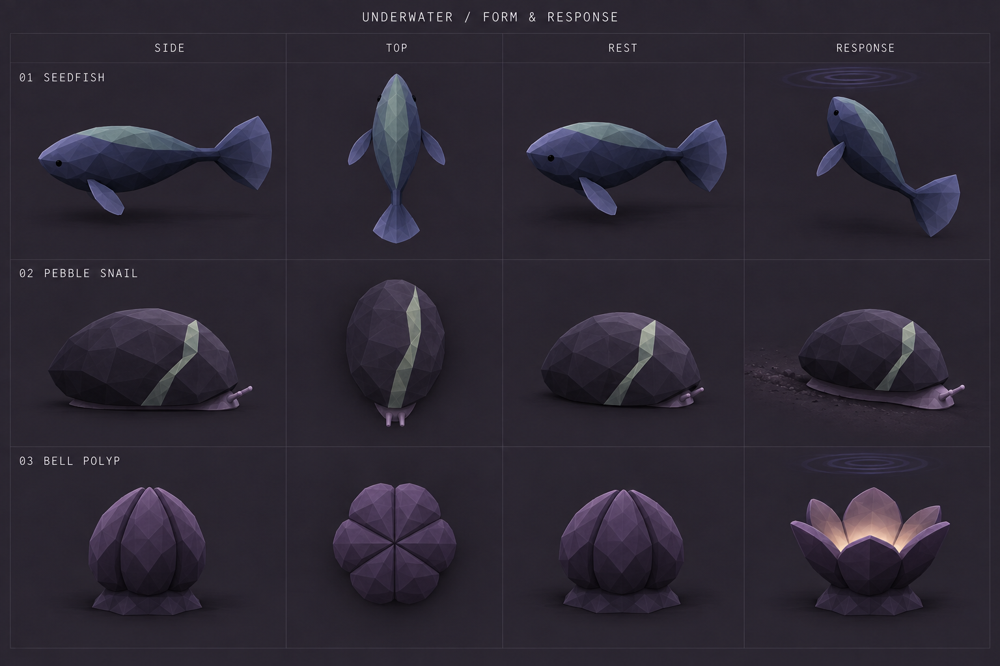

# Beneath the still water — underwater exploration v1

Updated direction: [exploration v2](../underwater-exploration-v2/README.md) develops bright red underwater fish, floating water-lily plants and whimsical snails from user feedback. This v1 remains as exploration history.

2026-09-18 · First-round concept proposal for Nowherelands II · Not implemented

A pool should reveal more life the longer you spend with it. Start with a small ecosystem that is readable from the bank: fish in the water column, snails on the bed, and rooted animals that answer a ripple. The reward is a change in behavior and sound.

## Renderings

- [Six-family exploration board](01-family-board.png)
- [Preferred families: form and response](02-form-and-response.png)
- [Encounter: arrive → be still → touch the water](03-pool-encounter.png)

Generated with the built-in image generation tool. These are design illustrations, not engine captures, finished meshes, animation atlases, or precise orthographic specifications. [Exact prompts and reference sources](PROMPTS.md).

## Fit with the game

Use broad facets, clear silhouettes, a few purposeful appendages and quiet motion. Charcoal, slate, muted sage and aubergine tie the creatures to the existing terrain and fauna. Common animals should remain visible without emitting light; a pale upper plane against a darker bed can do more than bloom. Reserve warm interior light for a brief polyp response.

The original fauna sheets establish the simple forms. The current atelier also includes small eyes and more developed anatomy, so a tiny dark eye is acceptable where it helps orientation; large expressive faces would change the tone.

The game already has small ambient fish in `WatersideLife.js`, and Lumens associated with water habitats in the fauna system. Seedfish should develop the physical underwater-fish role: opaque bodies, visible fins, schooling constrained below the surface. Avoid adding another luminous teardrop swarm. Decide whether they replace nearby ambient fish when implemented, so a pool does not carry two unrelated fish populations.

The player currently wades and floats over deeper water, with no diving control. Design encounters for a standing player looking down, first in sheltered shallow freshwater pools. The existing terrain, depth, current and foam data can later determine placement. Saltwater and deep-water species would be a separate expansion.

## Six candidate families

| Family | Form and movement | Home | Player relationship | Priority |
| --- | --- | --- | --- | --- |
| **Seedfish** | Blunt slate seed body, one fan tail, two opposing pectoral fins; short beats and quiet coasting, loose coordinated school | Clear margins and sheltered pool water, near plant cover | Retreat from splashes; return after stillness; turn toward one gentle ripple | First prototype: makes the pool visibly alive |
| **Pebble snails** | Low stone dome with one mineral seam, soft foot, two short sensory nubs; slow continuous glide | Submerged stones, silt margins and drowned wood | Withdraw when disturbed; emerge while player waits; reveal a short temporary furrow in silt | First prototype: slow observational discovery |
| **Bell polyps** | Rooted squat fleshy cups with six blunt lobes; close into a stone-like dome | Small clusters fixed to submerged stones in calm water | A gentle ripple opens cups sequentially, exposing dim warm interiors and a short musical reply; strong disturbance closes them | First prototype: clearest deliberate interaction |
| **Ribbon eels** | Slender flattened S-shaped body, narrow ridge, muted olive; continuous lateral wave | Sparse ribbon plants and sheltered crevices | Initially resemble vegetation; emerge after quiet, retreat into cover when approached | Later: strong reveal, more demanding body and obstacle motion |
| **Cup jellies** | Smoky translucent shallow bell, four short broad hanging ribbons; pulse and coast | Rare sheltered pockets with sufficient depth, away from rapids | Gentle ripple briefly entrains the next contraction; respond once, then resume their own rhythm | Later: useful contrast, but transparency competes with the water |
| **Silt paddlers** | Broad flat oval body, four short leaf-like paddles; settle, paddle and lift silt | Quiet sediment shelves beside stones | Pause and bury slightly when startled; resume clearing sediment after player gives space | Later: needs a distinctive silhouette and readable silt effects |

These are fictional freshwater animals. Their behavior and habitat should be internally coherent; the names do not require literal marine biology.

## First encounter

1. **Arrive.** Footstep disturbance sends a small school toward cover. Snails withdraw; polyps close. Movement is a brief readable response, not a frantic burst.
2. **Be still.** After roughly 4–8 seconds without nearby disturbance, fish begin returning at different times. A snail extends and moves. The world keeps its own rhythm; the entire pool should not stare at the player.
3. **Touch the water.** Aim at nearby reachable water and use the existing touch action. A small ripple travels outward. Fish turn toward it and the nearest relaxed polyps open as it reaches them. Each cup answers once with a short rounded, scale-compatible tone, slightly different in pitch and timbre.
4. **Listen and release.** Responses settle after a few seconds. Repeated tapping during a proposed 3–5-second recovery window adds no extra voices. Walking away lets the pool return to ordinary behavior.

All timings are starting hypotheses for a playable study, not tuned values. No fish chirp or snail voice is necessary: water movement and the polyp reply can carry the encounter.

A held/charged touch could produce a stronger pulse: fish take cover, snails retract and polyps close briefly. Make the ordinary tap rewarding first; charge should not become the optimal way to force more sound. No permanent harm, resource extraction or progression gate is needed for this first exploration.

Keep existing landmark touch priority. Only trigger a water touch when there is no closer interactable and the water hit is within reach; an unrestricted ground ripple is not sufficient. Use the same action for mouse, gamepad and touch.

## Form study and review notes

The second rendering refines the three preferred species, but several decisions remain open:

- **Seedfish:** retain exactly two opposite pectoral fins and one vertical fan tail. The generated top view broadens the tail as if it were horizontal; reconcile that in a real mesh. A small pale dorsal facet should carry readability without emission.
- **Snails:** the render still has small stalk-like nubs; try shorter blunt feelers and a lower shell. The resting pose should hide more of the foot. The mineral seam is a matte marking, not a glowing crack. Resolve direction and proportions across views before modeling.
- **Polyps:** they still read too much like opening flowers. Next pass should explore thick rounded lips, a squat asymmetrical cup and a shorter base. Keep the responsive interior, reduce petal-like points. Their silhouette should remain distinct from sprouts.
- **Jellies:** the board shows an upward-open bowl. The proposed form is a downward-facing shallow bell; compare both intentionally in a later study rather than treating the board as settled anatomy.
- **Paddlers:** check that they do not become miniature turtles or aquatic Pebble hoppers. Their four paddles should be the defining motion.
- **Encounter:** the scene is art directed and clearer than an untested runtime pool. It does not establish final scale, population, water optics or exact continuity between frames.

## What to build after selecting the forms

A small repeatable pool study is the most useful next step: one school, two snails, one polyp cluster, bank-height camera, optional orbit inspection, and Arrive / Still / Gentle ripple / Strong ripple / Reset controls. Compare dusk and night. Suggested starting counts are 6–10 fish and 3–5 polyps; tune visibility at the actual player eye height before choosing world-unit dimensions. The game uses an enlarged landscape scale, so literal real-world centimeter sizes are not a useful starting point.

Acceptance observations:

- Read fish direction, snail emergence and cup opening from the normal bank camera with normal bloom.
- Match creatures to valid bed depth and pool boundaries; never let fish cross dry banks or clip above the water.
- Settle naturally after disturbance without permanent attachment to the player.
- Hear one short reply from a polyp cluster, not overlapping repeated notes from every input or every frame.
- Keep behavior visible with audio muted.
- Verify submerged opaque creatures enter the scenery snapshot used by water refraction. Transparent jellies need a separate ordering/absorption investigation.
- Share meshes/materials for common species, activate detailed behavior only near the player, and measure the cost in a populated pool before widening placement.

Likely integration points: `js/world/WatersideLife.js`, `js/world/WaterOptics.js`, `js/world/InlandWater.js`, `js/player/Player.js`, existing fauna audio and atelier infrastructure. This exploration changes none of those systems.

## Suggested iteration

First settle the creature character: recognizable quiet pond animals, or stranger shapes closer to the abstract fauna? My starting preference is familiar movement with slightly unfamiliar forms, led by Seedfish + Pebble snails + Bell polyps. Then refine the polyp silhouette and choose one species for a consistent full turnaround and moving study.
