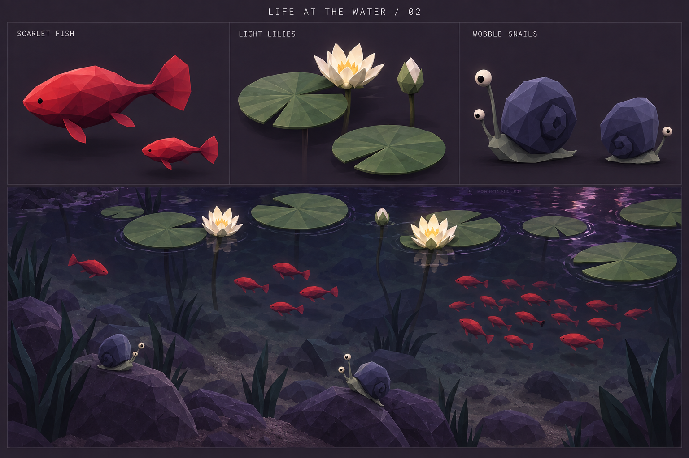
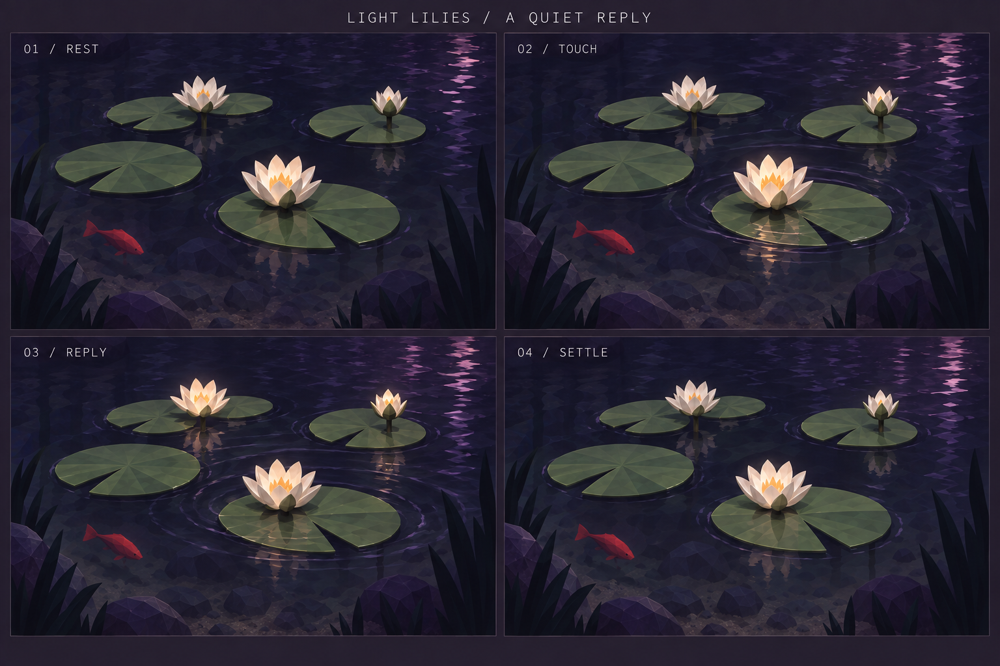
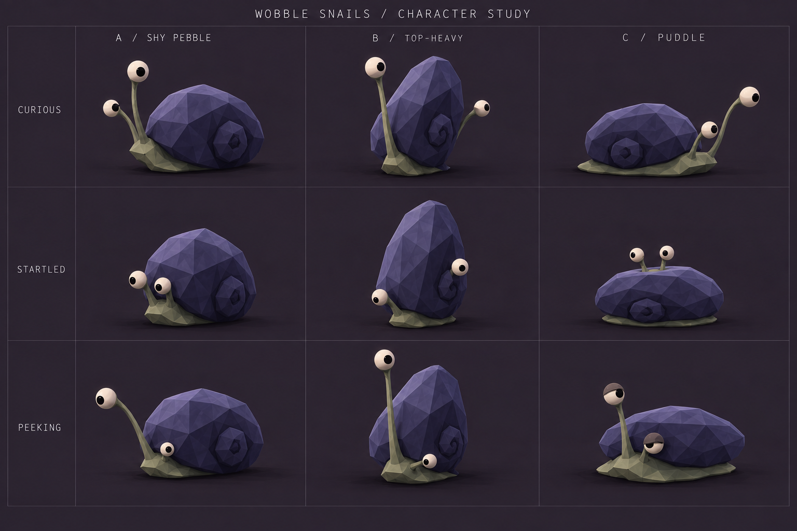

# Life at the water — exploration v2

2026-09-18 · Revised from user feedback · Concept art and design, not implemented

This revision focuses on three connected inhabitants of the pool: bright red fish below the water, luminous water-lily plants on the surface, and funny, curious snails on the submerged stones. It supersedes v1's muted fish, animal bell polyps and reserved snail design. The other v1 families are parked for now.

> Atelier revision: snails were dropped after the first moving study. Lilies now have no underwater stems and sit directly on the water with their cores inside the flowers. See the [current water atelier](../WATER_ATELIER.md). The images below remain concept history.

## Renderings

- [Revised direction and shared habitat](01-revised-direction.png)
- [Snail character alternatives](02-snail-character-study.png)
- [Water-lily light response](03-lily-light-response.png)

Generated using built-in imagegen. [Full generation prompts](PROMPTS.md). The user's [water-lily reference](references/user-water-lilies.png) is preserved with this exploration.

## Confirmed direction from the user

- Fish swim **underwater**, sometimes alone and sometimes in schools of different sizes. Bright red is the desired color direction.
- The former bell-polyp concept becomes a **plant**, inspired by floating water lilies. Its flower can play with light.
- Snails should be **whimsical and funny**, drawing personality from the pebble walkers.

Names, numerical ranges, exact forms and interaction timings below remain proposals.

## Scarlet fish

Keep the clear fish silhouette: blunt red body, narrow tail stalk, vertical fan tail and two opposite pectoral fins. Vermilion/coral upper planes and a carmine underside provide a strong colored presence. Red comes from the body material; emission is unnecessary.

Proposed encounter variety: solitary cruisers; loose groups of 2–5; ordinary schools of 6–12; occasional larger schools of 15–24 where the pool has room. These are starting ranges for tuning, not a requirement that every pool contain every group. Vary individual length modestly as well as school population. Solo fish should have an intentional cruising behavior, independent of a school.

Give each school its own route and spacing. Fish turn at slightly different times, coast between tail beats and separate around roots and stones. All movement stays in valid water volume, between bed clearance and surface clearance. Groups compress naturally around obstacles and spread into open water.

Player relationship: approaching or wading creates a local disturbance; fish move toward cover. Waiting allows them to resume their routes. A gentle ripple can prompt an orienting turn or brief curious approach, with individual variation. They need not all follow the player.

Visual priority: assess red readability through the actual water shader at bank height. Shallow fish should retain their bright color; deeper fish may become darker and less saturated. Preserve depth cues, reflections and occlusion. The existing ambient fish population should be considered when introducing this more developed fish.

## Light lilies — plants on the surface

Use the user's photograph as the structural anchor: broad round green pads with a radial notch, white flowers rising just above the surface, and flexible stalks descending toward roots in the bed. Each pad and flower has its own stalk. Populate quiet shallow water with loose patches and gaps through which fish remain visible.

Simplify leaves into a few broad radial planes and flowers into roughly 8–12 ivory petals around a warm center. Buds, partly open flowers and mature flowers add variation. Pads bob and tilt gently; plants stay rooted rather than drifting away. The proposed magical light response is fictional plant behavior.

Proposed interaction:

1. **Rest:** low moonlit ivory petals, nearly unlit heart, subtle movement with the water.
2. **Touch:** a reachable pad or nearby water receives a gentle tap. A small ripple forms and the nearest flower warms from its center outward.
3. **Reply:** two or three neighboring blossoms answer with a staggered light pulse. The first fades as the next brightens, forming a short visible phrase.
4. **Settle:** light fades and petals relax. Repeated tapping during recovery does not accumulate brightness or notes.

An optional soft musical note can accompany each response, tuned to the game's current scale. The light alone should communicate the interaction with sound muted. A larger disturbance briefly rocks the pads; it does not permanently damage the plant.

Light should show inside petals and as a small broken reflection on the water, with restrained bloom. Investigate emission, reflection and local illumination in the engine before choosing an implementation; the painting does not establish that the current water pass renders these effects. Avoid a costly dynamic light on every blossom.

## Wobble snails

The snail's personality comes from an oversized uneven shell, a small soft foot, and two independently extending eyestalks. The existing pebble fauna already use stalk extension, gaze and staggered blinking; this is a useful animation reference. Replace the v1 mineral-stripe dome with a simple off-center shell curl and more expressive posture.

| Variant | Character | Possible use |
| --- | --- | --- |
| **A — Shy Pebble** | Uneven broad shell, tiny foot, one eye stretches out while the other hangs back | Preferred starting design; closest link to the pebble fauna |
| **B — Top-heavy** | Tall oversized shell, a little precarious, eyes counterbalance its lean | Comedic silhouette or a rarer body proportion |
| **C — Puddle** | Low wide shell, soft extended foot, patient half-blinks | Sleepier individual variation |

These could become variations of one species rather than three species. Keep shell shape rigid while the foot and stalks bend.

A little encounter: the snail notices a ripple; one eye swivels first, then the other catches up. A splash causes a quick uneven withdrawal and a small shell rock. After a pause, one eye peeks out sideways; the second follows before the foot resumes sliding. Slow climbing over a pebble can add a tiny wobble and recovery. Aim for amusing timing without constant frantic movement.

Home: shallow submerged stones, margins and drowned wood where the player can see the eyes from above. Tune eye size and contrast for this distance. Shells and eyes need not glow. Do not add walking legs; the snail glides on one continuous foot.

## Next study and remaining visual decisions

A moving pool study can test solitary fish, small and larger schools, lily responses, and a snail encounter from the normal player camera. Keep the existing touch controls and prioritize closer existing interactables. No diving interaction is required.

The generated renders establish direction, not fixed geometry or reliable orthographic views. Before modeling:

- Put the fish's two pectoral fins on opposite sides; the large three-quarter illustration can read as both being on the near side.
- Give lily flowers their own rooted stalks beside pads; the light storyboard sometimes makes a blossom appear to grow from the center of a leaf.
- Keep the snail's two stalk roots on the front of its foot. A few variant poses obscure that connection or shift orientation.
- Reduce the near-identical warm appearance of Rest and Settle if testing shows the light response is too subtle. Preserve petal detail at peak brightness.
- Establish actual scale and population in the game; the renders use enlarged specimens for comparison.

No runtime files were changed in this iteration. Next design choice: select A, B or C as the snail's base silhouette, then reconcile its views and animate the curious → startled → peeking sequence.
