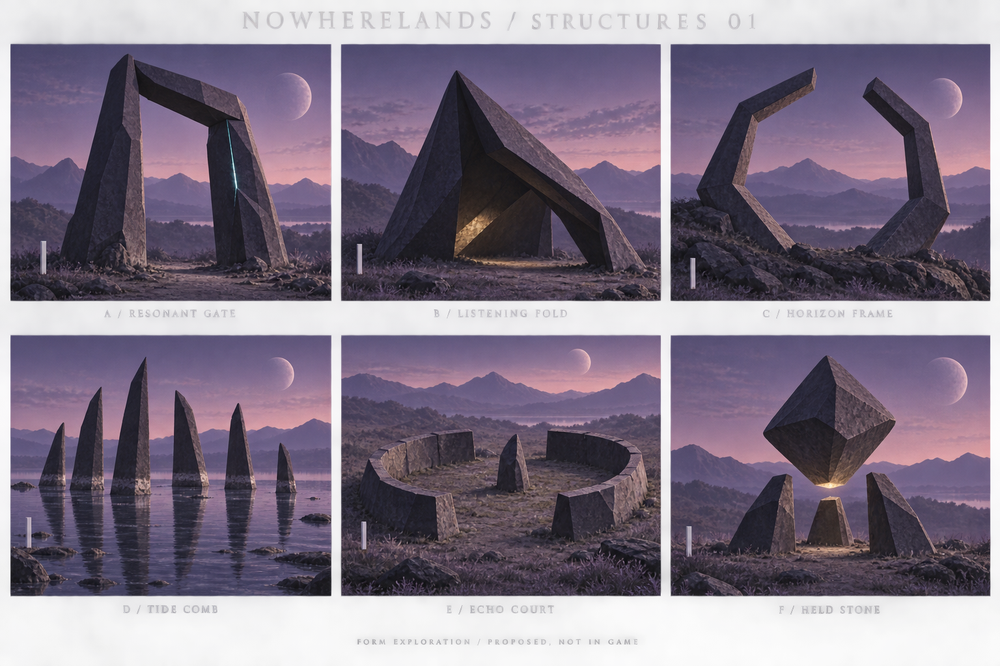
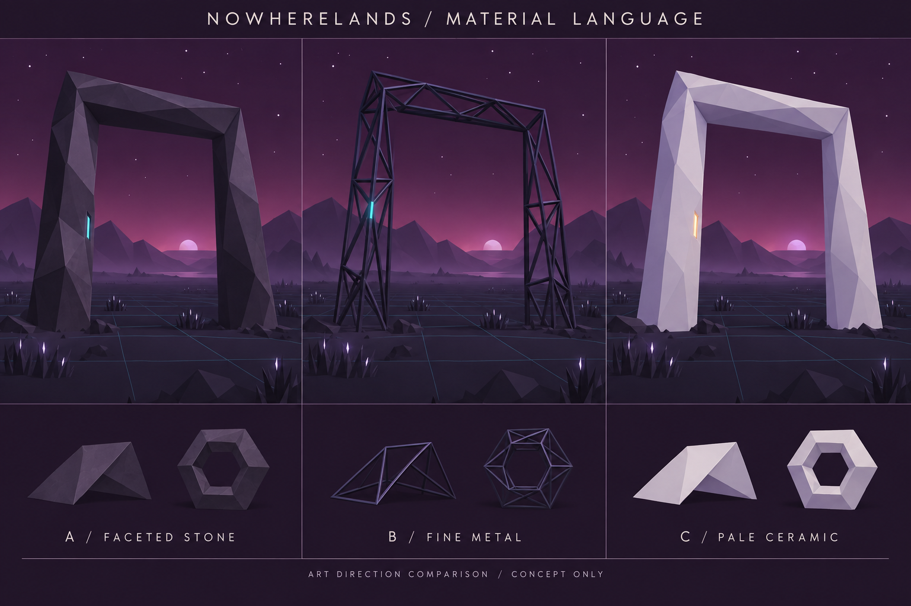
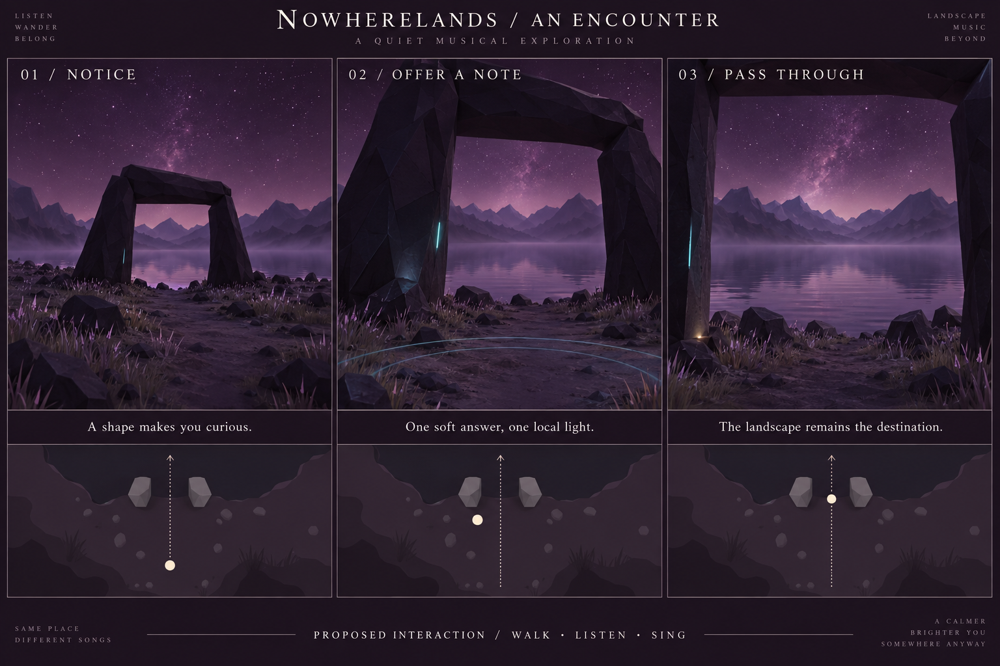

# Structures — first exploration

19 September 2026. **Proposal for discussion; no gameplay changes or selected direction yet.**

**Follow-up:** the user selected gate, fold and frame, including a main-music response for the fold. They are now available in the shared [atelier](../ATELIER.md). See the current [selected direction](../DIRECTION.md); the text below preserves the initial exploration.

## Direction

Add structures that make places: an opening to walk through, a roof to linger under, a frame that makes a distant ridge worth looking at. Give them an ambiguous origin and a restrained musical response. Their reward is a different experience of the landscape.

My recommendation is **faceted stone as the shared material, a resonant gate as the first prototype, and a listening fold as the next investigation**. A horizon frame provides a valuable quiet comparison: it can be worthwhile without emitting sound. Pale ceramic deserves a rare accent test. The names here describe forms and encounters; they do not establish lore.

## What the game already gives us

The current world combines dark faceted terrain, violet/magenta skies, fog, sparse luminous vegetation and small reflective or emissive landmarks. Existing encounters use the spiral, floating octahedra, a tiered clock, mirrors and a wanderer. Discovery affects the music; touch, player notes, walking and stillness already have consequences. Recent bell reeds and willow pendants extend that vocabulary into living things.

This suggests three criteria: a structure should have a readable silhouette at night, create a useful spatial relationship, and offer a response that leaves room for the environment. Another isolated glowing polyhedron would overlap the hollow stones; another sequenced musical circle would overlap the spiral. Architecture introduces an especially useful new ingredient: an **inhabitable gap**.

Evidence: [game overview](../../../README.md), [landmarks](../../../js/landmarks/Landmarks.js), [still clock](../../../js/landmarks/TimeMonolith.js), [hollow stones](../../../js/landmarks/Octahedrons.js), [vegetation direction](../../vegetation/DIRECTION.md). These observations come from local source and saved visual references, not a new live playtest.

## Six form families

| Family | Spatial purpose and setting | Proposed player encounter | Assessment |
| --- | --- | --- | --- |
| **A · Resonant gate** | Two tapered uprights and a lintel; shore terrace or meadow edge; frame a ridge or water view. | Walk through freely. Sing nearby or deliberately touch the inset to receive one soft hollow answer and a brief seam response. | **First prototype.** Clear spatial affordance; small amount of new geometry and collision work. Avoid suggesting a teleport portal. |
| **B · Listening fold** | Two or three thick folded planes; open-sided refuge on a clearing edge. | Step underneath and stop. Wind/rain become quieter, while a note has a short local tail. Leave and the outdoor mix returns. | **Strong second choice.** Introduces intimacy and weather contrast. Actual shelter requires additional weather integration. |
| **C · Horizon frame** | An incomplete polygonal ring at a safe overlook; its opening contains a distant landscape feature. | Move around it and discover how the view changes. Initially silent; moon alignment may create a glint, never a timed gate. | **Visual comparison.** Low interaction cost, but good orientation and sightlines matter more than shape complexity. |
| **D · Tide comb** | Uneven stone fins in sheltered shallows, with wide gaps and mineral water marks. | Wade between them. A player note produces one staggered answer across two or three nearby fins. | **Later.** Competes with reeds and the sequencer; must respect water coverage and habitat. “Tide” is a working name, not a claim that tides are simulated. |
| **E · Echo court** | Broken low enclosure on natural ground, generous exits, no paved platform. | Stand inside and hear a more focused version of your own note; walking out releases the effect. | **Reserve.** Can feel ceremonial or repeat the spiral. Interesting only if enclosure noticeably changes listening. |
| **F · Held stone** | One faceted mass held just above grounded supports; remote clearing. | Approach to hear a restrained low resonance; a deliberate touch could shift its balance slightly. | **Rare exception.** Strong mystery, but overlaps existing floating objects and is less spatially useful. No moving support beneath the player. |

The first board is a silhouette/mood exploration. Its rock texture, grass density and cinematic light are richer than the engine target. Do not reproduce those details literally. Its white markers are qualitative scale cues, not measured character drawings.

## Material and geometric language

**Faceted stone:** strongest continuity with terrain and the still clock. Use broad untextured planes, rough dark plum surfaces and a few lit-facing facets. Bury feet slightly; vary lean, taper and one broken edge within a coherent family. A small recessed contact seam can light briefly. Keep silhouettes legible without outlining every edge.

**Fine metal:** gives air and transparency but reads as constructed engineering. Thin trusses can disappear or shimmer at distance. Keep as an alternative to evaluate, or as small attachments; it is a weaker default for the landscape.

**Pale ceramic:** reads clearly and feels unfamiliar without extra light. It could mark a rare special place, but too much of it dominates the night palette. Test its brightest moonlit surfaces under the actual exposure and bloom before choosing it.

Use **wedges, thick folded planes, incomplete polygonal rings and repeated fins** as the core grammar. A sphere or levitating piece remains exceptional because existing landmarks already own those forms. Curves can be segmented into broad facets rather than densely tessellated. Most variation should come from proportion and placement, not adding fragments to every object.

For the first study, keep the ground continuous through openings. Avoid doors, stairs, paving, inscriptions and obvious domestic details: each would imply a history or play mechanic that this exploration has not established. Give most structures one quiet response at most; the horizon frame can remain silent.

## The first encounter

1. **Notice:** a dark opening interrupts the shore silhouette and frames a recognizable ridge. It remains attractive with sound muted and its contact seam unlit.
2. **Approach:** the path and both sides are visibly open. No automatic full-volume greeting. Place the contact inset near eye/hand level on an inner upright.
3. **Offer:** the existing note action prompts one low hollow tone drawn from the current scale. A short seam response makes the source readable. An aimed touch can produce the same response, consuming that gesture once.
4. **Pass through:** the lake view opens; the response decays. The gate stays physically still. Walking through need not trigger another note or discovery notification.
5. **Return:** it remains playable without accumulating new musical layers or permanently brightening the shore.

Initial tuning hypotheses: ordinary note response within roughly four eye heights of the contact point; a charged note extends the tail slightly rather than multiplying voices; response under three seconds; about a two-second retrigger interval; at most one structure answers a given note. These are audition values, not validated settings. Preserve a small visible acknowledgment when audio is muted. Do not require precise aiming, a pitch sequence, a time of day or a charged input to enjoy the space.

For a listening fold, compare standing just outside and just inside during rain. The outside rain should stay visible and audible through the opening; only the covered region and listener exposure change. Stillness can invite a quiet response, but should not become a countdown or a required wait.

## Scale and placement

The configured eye height is **11 world units**. Specify dimensions relative to that eye height (E), not literal human metres. Start a gate with 3–4 E of clear height, 2.5–3.5 E of clear width and a footprint around 5 E wide. Keep a target at 0.8–1.2 E above the local ground. A fold needs at least 1.5 E of headroom along every intended route. These dimensions need a first-person blockout; concept perspective does not validate clearance.

Place one controlled encounter before attempting continent-wide distribution. Inspect a shore, a forest edge and an overlook across `umbra`, `ondine-ossia` and a fresh seed. Rotate the opening toward an actual view or plausible approach; do not scatter forms with independent random headings.

Sample terrain beneath each footing, the entire opening and both approaches. Reject large height differences, submerged entries, cave mouths, steep drop-offs and occupied vegetation/collider footprints. Reserve the structure footprint and approach corridor during vegetation placement, leaving a natural irregular boundary. Establish clearance from existing landmarks so two encounters do not compete. Skip invalid sites after bounded retries.

Existing [Heightmap spot helpers](../../../js/world/Heightmap.js) are candidate finders, not full footprint validators: shore helpers can fall back to dry land, and `findFlatSpot` can return its original coordinates after failed searches. A water-specific structure must revalidate water; a gate must validate every support and its walk-through route after any fallback.

## How to add it

Build a small standalone structure study before integrating world population. Use the vendored three.js renderer and production lighting, exposure, fog and bloom for the final visual comparison; orbit views help inspect geometry, but acceptance requires the game's eye height and movement. Start with a gate, a fold blockout and a silent frame. Compare stone and ceramic, rest and response, and clear weather versus rain. The study page itself is a next step, not part of this delivery.

| Area | Existing support | Required extension |
| --- | --- | --- |
| Geometry | three.js primitives, flat-shaded materials, seeded `Random` | Parameterized wedges and thick plane/ring segments; shared materials; stable family variations. |
| Placement | Heightmap sampling and landmark spot helpers | Footprint/approach validation, orientation and vegetation exclusion. |
| Walking | [Player.js](../../../js/player/Player.js) resolves circular landmark barriers in XZ; height follows terrain or cave floor. | Use separate small footing colliders for a gate blockout, never one enclosing circle across the aperture. For folds/walls, use fitted capsule or convex footprints with player clearance and swept collision. No arbitrary mesh floors exist in this path. |
| Aimed interaction | [TargetPicking.js](../../../js/landmarks/TargetPicking.js) and `dispatchPress` | Register only reachable contact targets; add solid-structure occlusion checks, since target picking currently raycasts only interactable meshes. Keep one release from becoming both touch and free note. |
| Note response | [PlayerNotes.js](../../../js/player/PlayerNotes.js), explicit `player-note` routing in [main.js](../../../js/main.js) | Add a structure listener to that explicit route. Tag replies separately; never feed structure replies back into the player-note listener. Arbitrate range, voice limits and cooldowns alongside plants/fauna. |
| Local sound | [Conductor.js](../../../js/audio/Conductor.js), scale-aware voices and spatial notes | A bounded local response/send. Do not repeatedly overwrite global reverb: discovery and environmental updates already write its gain. |
| Shelter | [Weather.js](../../../js/world/weather/Weather.js) derives listener exposure from terrain/caves; [Precipitation.js](../../../js/world/weather/Precipitation.js) clips drops by their own position. | Add structure roofs to both the listener exposure query and precipitation roof data. A rendered roof alone does not supply shelter. Keep outside rain intact. |
| Discovery | `Events.DISCOVER` and existing unlock IDs | Prototype without new permanent music unlocks. Decide whether the final structure is a new landmark or a new presentation of an existing one after auditioning it. |

Bridges, stairs and walkable roofs belong to a later traversal study: they need support heights, step handling, swept collision and safe transitions between ground and structures. Existing cave support is not generic support for arbitrary scene meshes. Do not solve an open arch by treating its whole bounding volume as solid.

Initial performance targets per nearby site: under roughly 2,000 visible triangles, 2–4 draws for static structure geometry, shared materials, no new reflection pass, and emissive response before adding lights. These are proposed budgets, not measurements. Keep distant silhouettes static; only nearby sites need responsive animation. Check full-game frame pacing and audio on the current desktop/mobile profiles before setting population density.

## What the next prototype must resolve

- Can a player identify the opening at actual night exposure, without glow?
- Is passage comfortable from either side, including diagonal approaches, sprint, touch and gamepad? Do collision shapes match what looks solid?
- Does the gate feel like part of this landscape when seen beside trees and existing landmarks?
- Does one quiet answer read clearly without masking reeds, wildlife or music? Does repeated/charged input remain bounded, and does muting remain effective?
- Does the silent frame offer enough value through composition alone?
- Does the fold create audible and visible shelter without hiding the outdoors or trapping the player?
- Do placement, silhouettes and frame pacing hold across multiple seeds and distances?

**Decision after that study:** choose the material language and one spatial encounter to integrate. The recommended starting point is the stone gate; the listening fold offers the largest new interaction once shelter works. Keep the remaining families as comparisons rather than shipping all six together.

## Deliverables and limits

Three generated concept boards, this source-grounded design study, and the exact [prompts](PROMPTS.md). Created with the built-in imagegen tool. The boards were visually inspected; the second is the closest material/rendering target. The third communicates encounter sequence, not verified geometry, sound or navigation. Minor decorative text and extra rings in that image are not gameplay requirements.

No game source was modified. No engine prototype, new performance measurement or listening test was run for this conceptual study.
