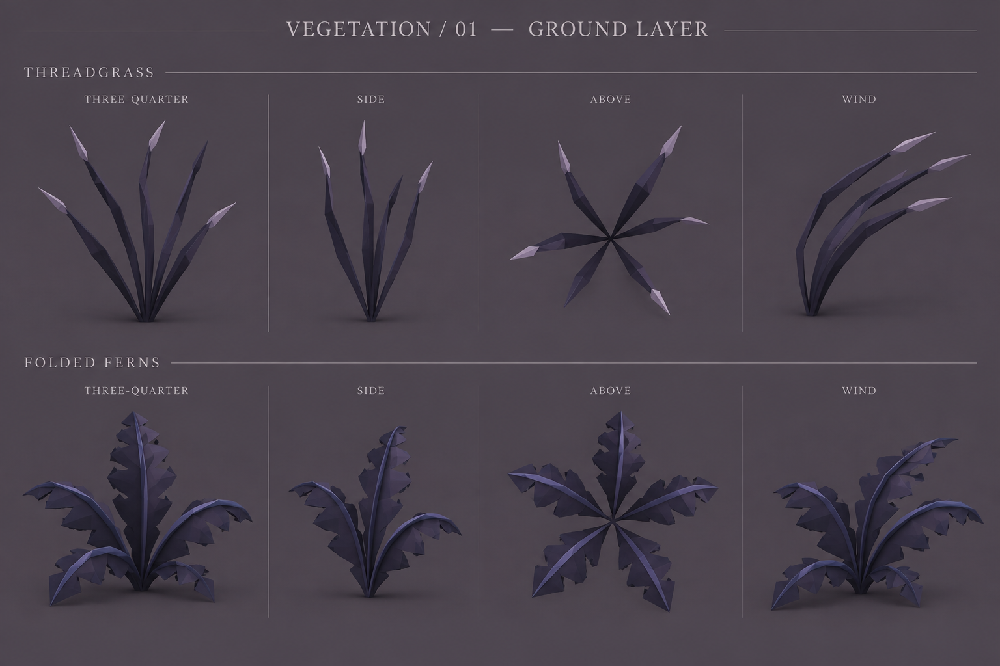
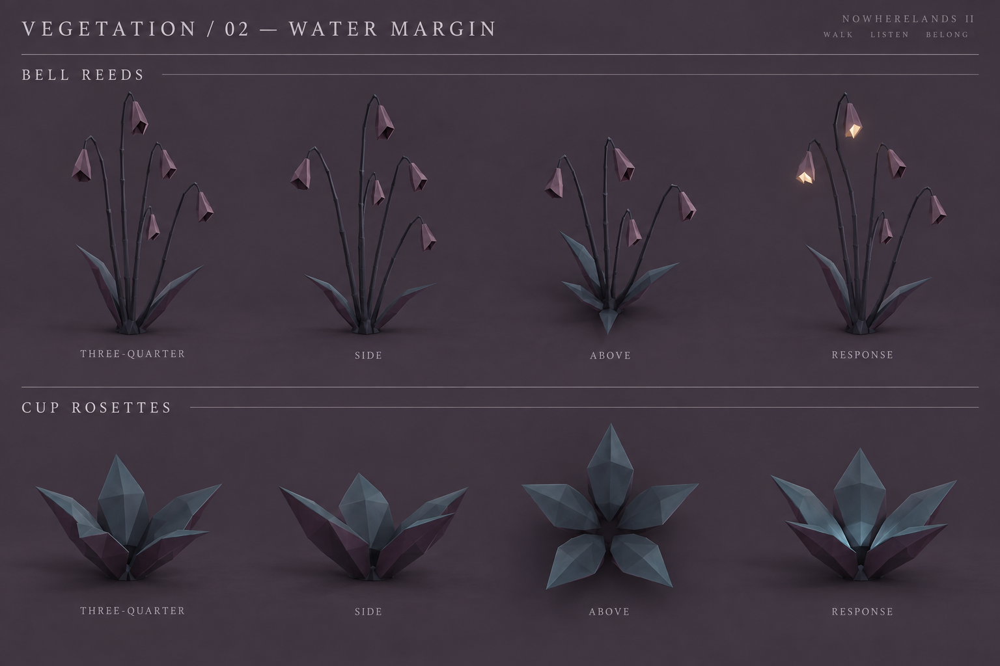
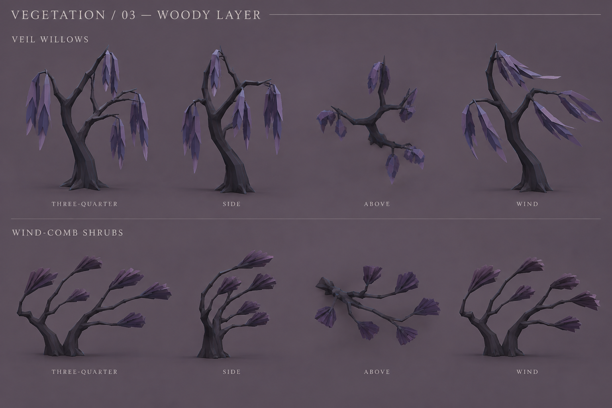
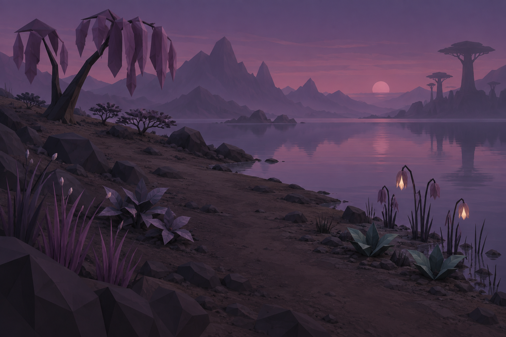

# Nowherelands II — Vegetation exploration v1

First direction study · 18 September 2026 · Six proposed plant families

Continue to [v2: bell reed and veil willow variations](../exploration-v2/README.md), following the selection of those two families for refinement.

Three form sheets and one habitat rendering, generated with the built-in image generation tool. These are discussion references, not implemented vegetation, animation frames, or exact modeling turnarounds. The proposed movements and musical responses below are design ideas. [Full generation prompts](PROMPTS.md).

## Direction

Give vegetation recognizable silhouettes and distinct habitats while preserving the world's quiet, faceted character. Dark plum and charcoal bodies, broad folded surfaces, exposed branches and large gaps should carry the design. Light is a small event within a plant, with most foliage remaining unlit. Plants should make the terrain, water and creatures easier to read.

The existing game already contains bare trees, old-growth giants, wind-pruned trees, grass, reeds, shrubs and waterside communities. This exploration builds on those roles with a more deliberate shape language. Keep the giant groves as the large-scale landscape structure; introduce character at walking height through groundcover, shore plants and occasional smaller trees.

## The six families

Heights below are exploratory proportions relative to player eye height, not real-world metres. The game uses an enlarged world scale; tune actual sizes against the player and fauna in a later 3D study.

| Family | Distinctive form | Habitat and approximate height | Proposed movement / response |
| --- | --- | --- | --- |
| **01 · Threadgrass** | Loose tufts of narrow, jointed ribbons with a few pale tips | Open meadows and moist clearings; 0.15–0.4× eye height | Wind passes through patches with slightly staggered bends. Nearby notes briefly brighten a few existing tips. |
| **02 · Folded ferns** | Low, broad fronds with a visible central fold and a small number of large leaflets | Sheltered forest floor, shaded banks and cave mouths with daylight; 0.2–0.5× | Frond tips lag behind a gust and settle slowly. Stay non-emissive; movement and reflected light provide the interest. |
| **03 · Bell reeds** | Thin stems carrying drooping hollow seed husks | Calm freshwater margins and backwaters; 0.5–1.0× | Husks tilt with the stalks. A nearby note could briefly light one or two interiors with warm ivory. Use silence or a rare soft dry rustle rather than constant chimes. |
| **04 · Cup rosettes** | Five broad folded leaves forming a shallow cup | Wet banks just above water, sheltered seep lines; 0.1–0.25× | A rare close response could open the leaves slightly. Test this without emission first; any later light should remain deep in the cup. |
| **05 · Veil willows** | Exposed forked trunk with sparse hanging foliage ribbons | Sheltered lake banks and moist forest edges; 2–4× | Hanging strips flex at fixed attachments, with delayed recovery after a gust. Remain non-emissive. |
| **06 · Wind-comb shrubs** | Low woody branches and wedge-like leaf clusters swept in one direction | Exposed coasts, rocky rises and the tree-line transition; 0.3–0.7× | Permanent wind-shaped architecture; only the ends flex during gusts. No emission. |

## Ground layer

Threadgrass develops the existing luminous grass into a more legible tuft. Ferns introduce a broad, dark shape below the trees. Use irregular patches with bare gaps, including small completely unlit grass patches; avoid a continuous glowing carpet.

## Water margin

Bell reeds are the strongest candidate for a distinctive new plant: their hollow husks read even with the lights off. Cup rosettes offer a low counterpoint to the vertical reeds. Keep clumps separated by exposed bank so small animals and the actual shoreline remain visible. Place these in quiet water habitats rather than rocky rapids or indiscriminately along every coast.

## Woody layer

Willows provide a hanging silhouette at a scale between shrubs and the existing giants. Wind-combs make exposure visible in the plant's architecture. Open branches could retain usable bird perches; low plants could frame walker and pebble encounters without hiding them. Those ecological relationships are proposals to test, not behavior added by this study.

## Together at the shore

This is a brighter concept-lighting view for judging the planting, not a capture of the current renderer. Groundcover occupies foreground pockets, reeds mark the wet edge, cups sit above the water, a willow frames the route and shrubs occupy the drier rise. The empty path and broad visible water are as important as the plants. Most real locations should use only two or three dominant families; this composition deliberately brings all six into one place for comparison.

## First critique and next iteration

- **Develop bell reeds and veil willows first.** They add the clearest new silhouettes and complement the game's existing light and wind behavior.
- **Make threadgrass softer and less spear-like.** The pale tips in the rendering look a little like solid seed heads; the intended form is one continuous tapered blade, with smaller light accents.
- **Simplify the ferns.** The generated fronds have more leaflets than requested. Try three broad pairs per frond and a lower, less upright silhouette.
- **Round out the cup rosettes.** Their current points read rather like crystals. Compare blunter leaves and a shallower cup before committing to the family.
- **Reduce willow density.** The render introduces more hanging leaf clusters than the intended eight ribbons. Test a few broad continuous strips against this more leafy version.
- **Flatten the wind-combs.** The current sheet reads partly as a small tree. Lower the branch forks and stretch the crown horizontally to separate it from the willow and existing bare trees.

The images are useful for silhouette and mood, but their view angles, leaf counts, branch topology and proportions drift between panels. The water-margin sheet also contains an unrequested decorative tagline, which is not proposed game copy. Written form descriptions take precedence; a later shared 3D specimen should establish consistent geometry and true views.

After choosing a family, the next study should compare two or three silhouettes, inspect one plant and a patch under neutral and game-night lighting, then audition wind and any restrained musical response. Use the existing habitat fields, vegetation batching, wind and distance transitions when integrating approved forms. These references do not establish a new geometry or performance budget.
