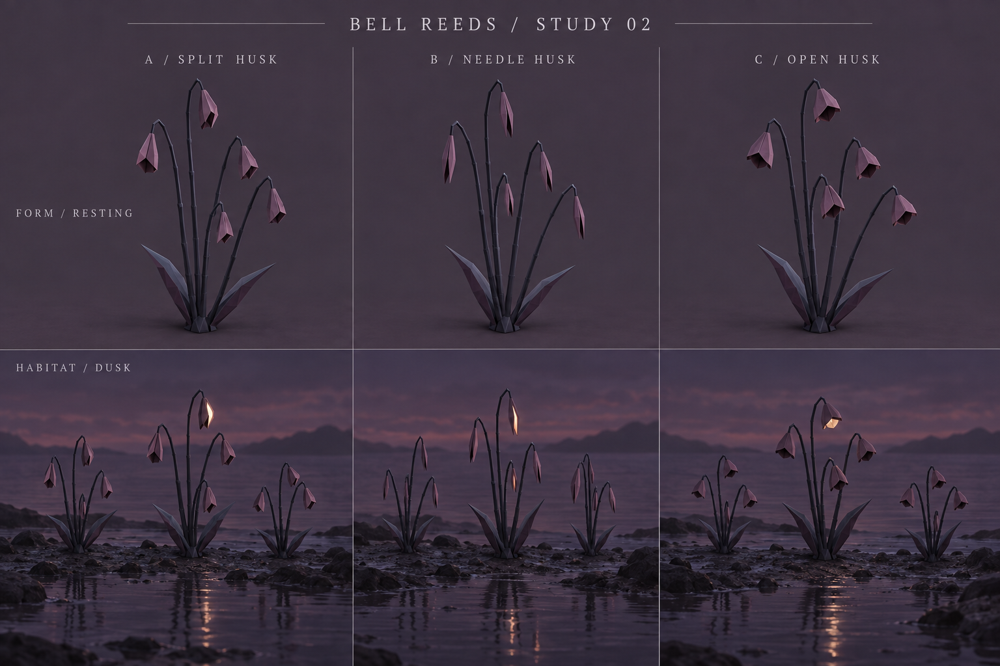
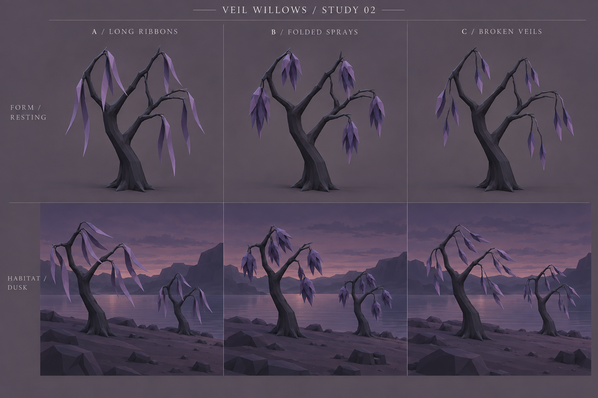

# Vegetation exploration v2 — Bell reeds & veil willows

18 September 2026. The user selected bell reeds and veil willows as the promising families from [v1](../exploration-v1/README.md). This pass compares three directions for each, before choosing a form for a 3D study.

**Selection after review:** bell reeds **C / Open husk**; willow **A, B and C as variations of one species**. The original recommendations below are retained as critique history and are superseded by these choices. See the [current design direction](../DIRECTION.md) for variation and interaction proposals.

Both boards were generated with built-in `image_gen.imagegen` using the corresponding v1 sheet as a visual reference. [Full prompts and reference paths](PROMPTS.md).

## Bell reeds

| Variant | Character | Tradeoff |
| --- | --- | --- |
| **A / Split husk** | Folded seed case with a visible opening; closest to the first study | Strong identity at rest, with room for a small recessed light. The folds still need softening slightly to avoid a crystal-like impression. |
| **B / Needle husk** | Slender wrapped case with a narrow slit | Delicate and restrained, but the husk may disappear at ordinary walking distances. |
| **C / Open husk** | Shorter, broader case with an open underside | Easy to read, though closer to a hanging flower or decorative lantern. |

**Suggested direction: A.** Keep the asymmetrical split and thin stalk. Vary stalk height and husk orientation so patches feel grown. The light should illuminate a recessed inner surface; the exterior remains opaque. Start with mostly unlit plants and let one or two husks briefly answer a nearby note. Wind should flex stalks with slight lag at the husks, rather than rotate the entire clump rigidly. Movement and response remain proposals, not implemented behavior.

The intended scale remains roughly half to one player eye-height per clump, with small husks. The rendering makes those husks fairly prominent; actual scale and brightness need comparison in the game before settling them.

## Veil willows

| Variant | Character | Tradeoff |
| --- | --- | --- |
| **A / Long ribbons** | Sparse continuous leaves; long hanging silhouette | The most ghostly and distinctive option. Needs careful taper and folding to remain botanical rather than resembling fabric. |
| **B / Folded sprays** | Small pendant groups of overlapping leaves | Closest to the appealing original; reads as living foliage and holds its shape well at a distance. Can become too dense if repeated heavily. |
| **C / Broken veils** | Leaves separated along exposed drooping twigs | Airy and delicate, but the fine hanging structure may disappear at distance. |

**Suggested direction: B**, keeping the open trunk and deliberately sparse sprays. A is a strong alternative if we want the trees to feel stranger. A later variation could lengthen only a few of B's terminal leaves, retaining the botanical structure while borrowing some of A's hanging rhythm.

Keep these as occasional smaller shore trees, roughly two to four player eye-heights tall, below the existing giant forest scale. Their leaves stay non-emissive. Broad reflected highlights and wind should provide their life. The primary limbs remain stable while hanging stems and leaves bend with staggered recovery; avoid moving every spray in perfect synchrony.

## What these boards establish

The upper rows compare resting form under neutral light; the lower rows compare small groups at dusk. Those lower rows also change planting and lighting, so they are not controlled before/after comparisons. The reed habitat backgrounds drift toward realistic wet stones and water; only the plant forms and sparse arrangement are relevant to the game's art direction. The willow backgrounds remain closer to the game's faceted treatment.

These are concept renderings rather than exact modeling views. Generated leaf counts and branch topology do not fully obey the prompts, and the needle-reed habitat shows more than the requested single lit husk. Future geometry should follow a chosen written brief. No models, wind animation, habitat placement, or player-note responses were added to the game by this pass.

With the families selected, the next study can develop variation within the open-husk reeds and compare all three willow forms as one population. A shared 3D specimen can then resolve true proportions, night readability and movement without further image-to-image topology drift.
